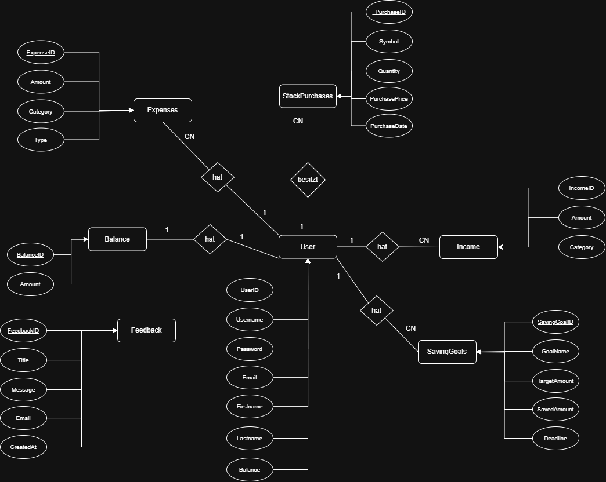
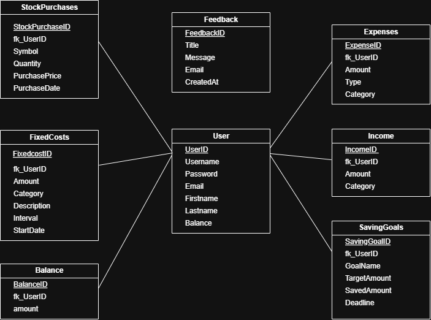
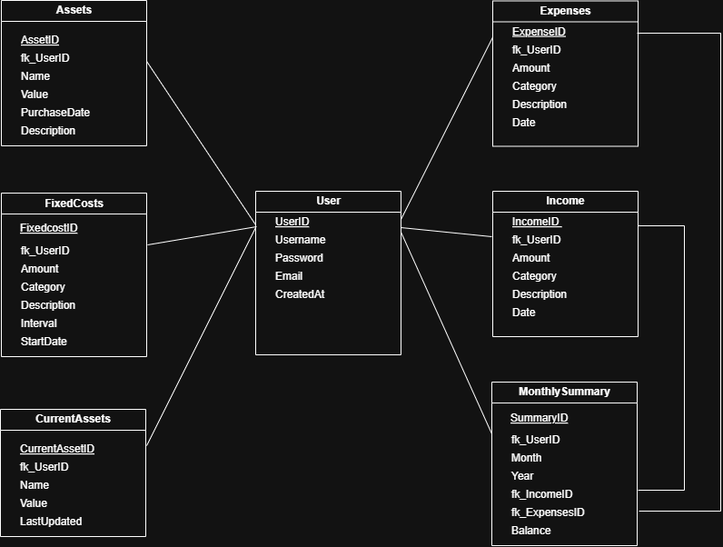
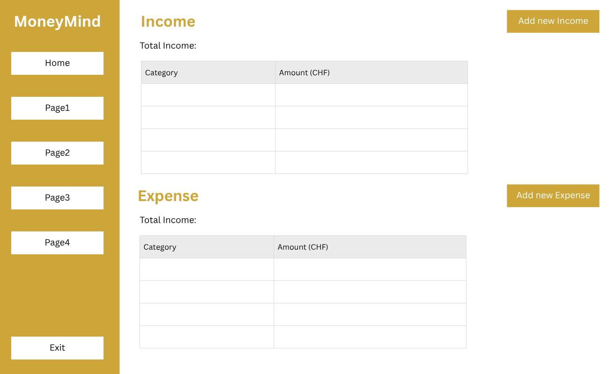
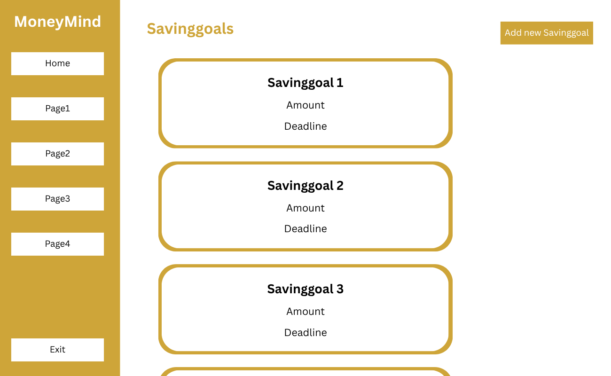

# MoneyMind

**MoneyMind** ist eine App zur Verwaltung von Einnahmen, Ausgaben und Sparzielen. Sie wurde im Rahmen des IPT6.1 Projekts im 2. Ausbildungsjahr der IMS entwickelt.

---

## Features

* 📥 Einnahmen & Ausgaben erfassen
* 🎯 Sparziele hinzufügen und verwalten
* 👤 Benutzerregistrierung & Login
* 💾 Lokale Datenspeicherung mit SQLite
* 🔄 SQL-Skripte für Setup, Update & Beispielinhalt
* 🧪 Unit Tests für zentrale Logik
* 🧩 Verwendung von Interfaces & Singleton-Pattern

---

## Technologien

| Bereich     | Technologie                 |
| ----------- | --------------------------- |
| Frontend    | WPF (.NET)                  |
| Backend     | C# (OOP)                    |
| Datenbank   | SQLite + SQL Scripts        |
| Architektur | MVVM, Interfaces, Singleton |
| Testing     | MSTest / xUnit              |

---

## Installation

1. Repository klonen:

```bash
git clone https://github.com/Timon1177/MoneyMind.git
```

2. Projekt mit Visual Studio öffnen
3. Build starten (inkl. Restore)
4. Anwendung ausführen

---

## Diagramme

### ER-Modell



### Relationales-Modell



### UML-Klassendiagramm



### Programmablaufplan


---

### Mockup






---

## Video

[Projektvideo ansehen](./Video.mp4)

---

## Nutzung

1. Benutzerkonto erstellen oder einloggen
2. Einnahmen/Ausgaben erfassen
3. Sparziele setzen & verfolgen
4. Daten über das Hauptmenü verwalten

---

# Eingabefelder & Validierung in MoneyMind

Diese Datei dokumentiert alle vom Benutzer auszufüllenden Felder inklusive Datentyp, Pflichtfeldstatus und der Validierungslogik.

| Eingabefeld           | Beschreibung                    | Datentyp   | Pflichtfeld | Validierung                                                                 |
|-----------------------|----------------------------------|------------|-------------|------------------------------------------------------------------------------|
| Username              | Benutzername                    | string     | ✅ Ja       | Nicht leer, eindeutig                                                        |
| Password              | Passwort                        | string     | ✅ Ja       | Nicht leer, Mindestlänge empfohlen                                           |
| Email                 | E-Mail-Adresse                  | string     | ✅ Ja       | Nicht leer, gültiges E-Mail-Format (optional)                               |
| IncomeAmount          | Einkommensbetrag                | double     | ✅ Ja       | > 0, gültige Zahl                                                            |
| IncomeCategory        | Kategorie des Einkommens        | string     | ✅ Ja       | Nicht leer                                                                   |
| ExpenseAmount         | Ausgabebetrag                   | double     | ✅ Ja       | > 0, gültige Zahl                                                            |
| ExpenseCategory       | Kategorie der Ausgabe           | string     | ✅ Ja       | Nicht leer                                                                   |
| ExpenseType           | Art der Ausgabe (Fixed/Other)   | string     | ✅ Ja       | Muss "Fixed" oder "Other" sein                                               |
| SavingGoalName        | Name des Sparziels              | string     | ✅ Ja       | Nicht leer                                                                   |
| SavingGoalAmount      | Betrag des Sparziels            | double     | ✅ Ja       | > 0, gültige Zahl                                                            |
| SavingGoalDeadline    | Zieldatum für das Sparziel      | DateTime   | ✅ Ja       | Format: yyyy-MM-dd, Datum muss in der Zukunft liegen                         |

---

## Dokumentation

---

## Modulzuordnung & Anforderungen

### Modul 106 – Datenbankabfragen, -bearbeitung und -wartung

* Zugriff auf SQLite-Datenbank
* Methoden zur Datenmanipulation und -abfrage implementiert

### Modul 162 – Daten analysieren und modellieren

* ER-Modell und relationales Modell erstellt
* Als Bilder im Repository unter `/Diagramme/` gespeichert

### Modul 164 – Datenbanken erstellen & Daten einfügen

* SQL-Skripte zum Erstellen, Updaten und Einfügen von Beispieldaten unter `/create_database/`
* Beim Start wird geprüft, ob die Datenbank vorhanden ist

### Modul 319 – Applikationen entwerfen & implementieren

* Funktionsdefinition & Ziele im Projekt festgehalten
* Programmablaufplan (PapDesigner) unter `/Diagramme/Programmablaufplan.png`
* Alle Inhalte dokumentiert via Markdown im Repository

### Modul 322 – Benutzeroberflächen entwerfen

* Mockups in der Entwurfsphase erstellt
* Pflichtfelder und Eingabetypen dokumentiert
* Validierung und Benutzerfeedback in der App eingebaut

### Modul 320 – Objektorientierte Programmierung

* Verwendung von Klassen, Vererbung, Polymorphismus, Abstraktion
* Umsetzung mit Singleton Pattern für die DB-Verbindung
* Schnittstellen (Interfaces) implementiert
* UML-Diagramm unter `/Diagramme/UML_Diagramm.png`

---

## Team

Dieses Projekt wurde im 2. Jahr an der Informatikmittelschule Luzern im Rahmen des IPT6.1-Projekts von Timon & Kay umgesetzt.


