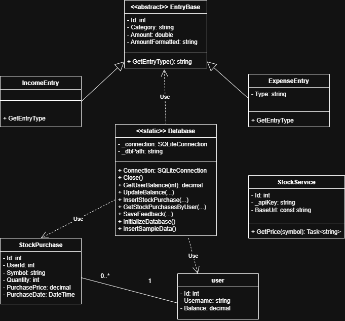

# MoneyMind

**MoneyMind** ist eine App zur Verwaltung von Einnahmen, Ausgaben und Sparzielen. Sie wurde im Rahmen des IPT6.1 Projekts im 2. Ausbildungsjahr der IMS entwickelt.

---

## Video

[Projektvideo ansehen](./Video.mp4)

---

## Features

* 📥 Einnahmen & Ausgaben erfassen
* 🎯 Sparziele hinzufügen und verwalten
* 👤 Benutzerregistrierung & Login
* 💾 Lokale Datenspeicherung mit SQLite
* 🔄 SQL-Skripte für Setup, Update & Beispielinhalt
* 🧪 Unit Tests für zentrale Logik
* 🧩 Verwendung von Interfaces & Singleton-Pattern

---

## Technologien

| Bereich     | Technologie                 |
| ----------- | --------------------------- |
| Frontend    | WPF (.NET)                  |
| Backend     | C# (OOP)                    |
| Datenbank   | SQLite + SQL Scripts        |
| Architektur | MVVM, Interfaces, Singleton |
| Testing     | MSTest / xUnit              |

---

## Installation

1. Repository klonen:

```bash
git clone https://github.com/Timon1177/MoneyMind.git
```

2. Projekt mit Visual Studio öffnen
3. Build starten (inkl. Restore)
4. Anwendung ausführen

---

## Diagramme

### ER-Modell


### Relationales-Modell


### UML-Klassendiagramm



### Programmablaufplan


---

### Mockup


---

## Nutzung

1. Benutzerkonto erstellen oder einloggen
2. Einnahmen/Ausgaben erfassen
3. Sparziele setzen & verfolgen
4. Daten über das Hauptmenü verwalten

---

# Eingabefelder & Validierung in MoneyMind

Diese Datei dokumentiert alle vom Benutzer auszufüllenden Felder inklusive Datentyp, Pflichtfeldstatus und der Validierungslogik.

| Eingabefeld           | Beschreibung                    | Datentyp   | Pflichtfeld | Validierung                                                                 |
|-----------------------|----------------------------------|------------|-------------|------------------------------------------------------------------------------|
| Username              | Benutzername                    | string     | ✅ Ja       | Nicht leer, eindeutig                                                        |
| Password              | Passwort                        | string     | ✅ Ja       | Nicht leer, Mindestlänge empfohlen                                           |
| Email                 | E-Mail-Adresse                  | string     | ✅ Ja       | Nicht leer, gültiges E-Mail-Format (optional)                               |
| IncomeAmount          | Einkommensbetrag                | double     | ✅ Ja       | > 0, gültige Zahl                                                            |
| IncomeCategory        | Kategorie des Einkommens        | string     | ✅ Ja       | Nicht leer                                                                   |
| ExpenseAmount         | Ausgabebetrag                   | double     | ✅ Ja       | > 0, gültige Zahl                                                            |
| ExpenseCategory       | Kategorie der Ausgabe           | string     | ✅ Ja       | Nicht leer                                                                   |
| ExpenseType           | Art der Ausgabe (Fixed/Other)   | string     | ✅ Ja       | Muss "Fixed" oder "Other" sein                                               |
| SavingGoalName        | Name des Sparziels              | string     | ✅ Ja       | Nicht leer                                                                   |
| SavingGoalAmount      | Betrag des Sparziels            | double     | ✅ Ja       | > 0, gültige Zahl                                                            |
| SavingGoalDeadline    | Zieldatum für das Sparziel      | DateTime   | ✅ Ja       | Format: yyyy-MM-dd, Datum muss in der Zukunft liegen                         |

---

## Dokumentation

* **Markdown-Dokumentation**:
  - Alle projektrelevanten Inhalte (Ziele, Architektur, Validierung) sind direkt im README dokumentiert.
  - Zusätzliche Notizen und Planungen befinden sich im Ordner `/Dokumentation/` (falls vorhanden).

* **Validierung & Pflichtfelder**:
  - Alle Eingabefelder, Datentypen und Validierungsregeln sind im Abschnitt **„Eingabefelder & Validierung“** dokumentiert (inkl. Pflichtfelder).

* **Unit Testing & Architekturprinzipien**:
  - Unit Tests mit xUnit prüfen zentrale Logik (z. B. Transaktionen, Datenbankverbindung).
  - Datenbankverbindung über **Singleton Pattern** implementiert.
  - Logik durch **Interfaces** abstrahiert (z. B. für Transaktionen und Benutzerverwaltung).

* **Diagramme & Visualisierungen**:
  - ER-Modell, relationales Modell, UML-Diagramm und Programmablaufplan sind im Ordner `/Diagramme/` gespeichert und oben eingebunden.
  - Mockups der Benutzeroberfläche liegen im Ordner `/Mockup/`.

* **Objektorientierte Prinzipien**:
  - Vererbung: `Income` und `Expense` erben von `Transaction`.
  - Polymorphismus: Einheitliche Methoden dank Interface `ITransactionService`.
  - Abstraktion: Gemeinsame Methoden in Basisklassen ausgelagert.

* **Stocks**:
  - Wir nahmen uns eigentlich in der Mitte des Projektes das Ziel mithilfe einer API ein Stock hinzuzufügen in welchen man investieren kann. Wir kamen mithilfe eines Tutorials gut voran jedoch reichte die Zeit nicht dies ganz zu beenden. Wir werden dies in naher Zukunft aber noch machen. 
---

## Modulzuordnung & Anforderungen

### Modul 106 – Datenbankabfragen, -bearbeitung und -wartung

* Zugriff auf SQLite-Datenbank
* Methoden zur Datenmanipulation und -abfrage implementiert

### Modul 162 – Daten analysieren und modellieren

* ER-Modell und relationales Modell erstellt
* Als Bilder im Repository unter `/Diagramme/` gespeichert

### Modul 164 – Datenbanken erstellen & Daten einfügen

* SQL-Skripte zum Erstellen, Updaten und Einfügen von Beispieldaten unter `/create_database/`
* Beim Start wird geprüft, ob die Datenbank vorhanden ist

### Modul 319 – Applikationen entwerfen & implementieren

* Funktionsdefinition & Ziele im Projekt festgehalten
* Programmablaufplan (PapDesigner) unter `/Diagramme/Programmablaufplan.png`
* Alle Inhalte dokumentiert via Markdown im Repository

### Modul 322 – Benutzeroberflächen entwerfen

* Mockups in der Entwurfsphase erstellt
* Pflichtfelder und Eingabetypen dokumentiert
* Validierung und Benutzerfeedback in der App eingebaut

### Modul 320 – Objektorientierte Programmierung

* Verwendung von Klassen, Vererbung, Polymorphismus, Abstraktion
* Umsetzung mit Singleton Pattern für die DB-Verbindung
* Schnittstellen (Interfaces) implementiert
* UML-Diagramm unter `/Diagramme/UML_Diagramm.png`

---

## Team

Dieses Projekt wurde im 2. Jahr an der Informatikmittelschule Luzern im Rahmen des IPT6.1-Projekts von Timon & Kay umgesetzt.


